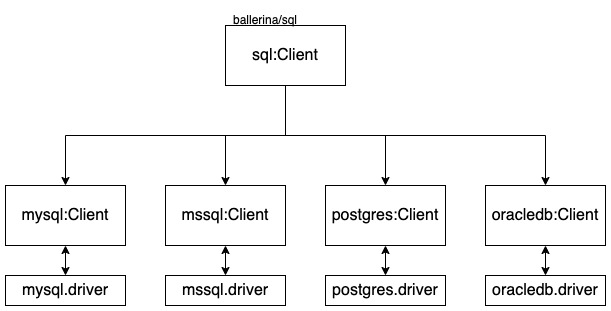
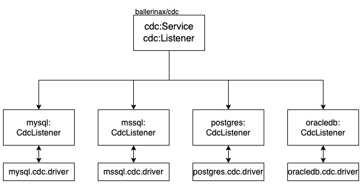

# CDC Support in Ballerina

- Author: @niveathika
- Reviewers: @daneshk @ThisaruGuruge
- Created: 2025-03-16
- Updated: 2025-05-06
- Issue: [#1341](https://github.com/ballerina-platform/ballerina-spec/issues/1341)
- Status: Submitted

## Summary

This proposal aims to integrate Change Data Capture (CDC) support into Ballerina, enabling real-time tracking and processing of database changes (INSERT, UPDATE, DELETE). The solution will provide a seamless and scalable way for Ballerina applications to consume CDC events.

Please add any comments to issue [#1341](https://github.com/ballerina-platform/ballerina-spec/issues/1341).

---

## Goals

- Enable real-time CDC support for various databases in Ballerina.
- Provide a Ballerina connector API to consume CDC events seamlessly.
- Ensure lightweight, scalable, and efficient CDC integration.

---

## Motivation

CDC is a critical component in real-time data integration, benefiting industries like finance, healthcare, retail, and telecommunications. Since Ballerina is designed for seamless integration, native CDC support enhances its ability to:

- Connect different systems efficiently.
- Process real-time database events.
- Streamline data workflows with minimal overhead.

---

## Design

### Possible Approaches

1. **JDBC Polling**  
   ✅ Simple, works with standard JDBC drivers.  
   ✅ Compatible with MSSQL native CDC support.  
   ❌ Polling introduces delays in detecting changes.  
   ❌ Adds additional load on the database.  

2. **Debezium-Based CDC (Preferred)**  
   ✅ Provides real-time changes.  
   ✅ Uses log-based CDC, avoiding additional database load.  
   ✅ Designed for high-frequency updates.  
   ✅ Supports event filtering, transformation, and error handling.  
   ❌ Requires a Kafka cluster.  

Ballerina's CDC component will use **Debezium** as the underlying engine to capture database events. The module will use **Debezium in Embedded mode**, which does not make a Kafka cluster mandatory.

---

### Module Organization

Similar to the organization of the `ballerina/sql` module, where the `sql:Client` is extended by database-specific packages such as `mysql:Client`, `mssql:Client`, `postgres:Client`, and `oracledb:Client`, the CDC module will follow a similar structure.

The following diagram shows the organization of the SQL module:



The CDC module implementation will be structured into the following key components:



1. **Core Module**  
   The core module will act as the foundation for CDC support in Ballerina.

   ```
   module-ballerinax-cdc
   ```

   The core module will include the CDC service, shared configurations, utilities, and an abstract listener that can be reused across database-specific implementations.

2. **Database-Specific Listeners**  
   Each supported database will have its dedicated listener, available in the respective database default packages. For example:

   ```
   module-ballerinax-mysql
   module-ballerinax-mssql
   ```

   The `CdcListener` will be available alongside the `Client` in the default package to connect to the database.

3. **Database-Specific Driver Modules**  
   These modules will package the necessary dependencies for different database CDC connectors. They can be imported as ignored imports.

   Examples:
   ```
   module-ballerinax-mysql.cdc.driver
   module-ballerinax-mssql.cdc.driver
   ```

   ```ballerina
   import ballerinax/mssql.cdc.driver as _;
   ```

### Components

#### 1. Listeners

Each supported database will have a dedicated `CdcListener` available in the respective database packages. These listeners are responsible for capturing database change events and routing them to the attached services for processing.

> **Note**: A single, unified listener for all databases was **scrapped** due to usability issues. While different databases share similar configuration structures, their varying default values caused "Ambiguous type" errors in Ballerina's type system, requiring manual type casting. To address this, database-specific listeners were introduced for better usability and type safety.

---

##### Example: MySQL Listener

The following example demonstrates the structure of a `CdcListener` for MySQL:

```ballerina
# Ballerina CDC Listener
public isolated class CdcListener {

    public isolated function init(*MySqlListenerConfiguration config) {
        // Process configurations
    }

    public isolated function attach(cdc:Service s, string[]|string? name = ()) returns Error? =
        @java:Method { 'class: "io.ballerina.lib.cdc.Listener" } external;

    public isolated function 'start() returns Error? =
        @java:Method { 'class: "io.ballerina.lib.cdc.Listener" } external;

    public isolated function detach(cdc:Service s) returns Error? =
        @java:Method { 'class: "io.ballerina.lib.cdc.Listener" } external;

    public isolated function gracefulStop() returns Error? =
        @java:Method { 'class: "io.ballerina.lib.cdc.Listener" } external;

    public isolated function immediateStop() returns Error? =
        @java:Method { 'class: "io.ballerina.lib.cdc.Listener" } external;
}
```

---

#### Listener Configuration

Each listener requires a set of **mandatory and optional** configuration properties to define its behaviour. These configurations are divided into general CDC configurations (available in the `cdc` module) and database-specific configurations (available in the respective database modules).

##### Database-Specific Configuration (Available in Database Modules)

Each database module provides additional configurations specific to the database. For example:

###### MySQL Module

```ballerina
public type MySqlListenerConfiguration record {| 
    *cdc:CdcConfiguration;
    string connectorClass = "io.debezium.connector.mysql.MySqlConnector";
    MySqlDatabaseConnection database;
|};

public type MySqlDatabaseConnection record {|
    *cdc:DatabaseConnection;
    string hostname = "localhost";
    int port = 3306;
    string databaseServerId = (checkpanic random:createIntInRange(0, 100000)).toString();
    string|string[] includedDatabases?;
    string|string[] excludedDatabases?;
    int tasksMax = 1;
    cdc:SecureDatabaseConnection secure = {};
|};
```
##### General CDC Configuration (Available in `cdc` Module)

The `ListenerConfiguration` type defines the general properties required for all listeners:

```ballerina
public type ListenerConfiguration record {|
    string engineName = "ballerina-cdc-connector";
    string connectorClass;
    int maxQueueSize = 8192;
    int maxBatchSize = 2048;
    decimal queryTimeout = 60;
    FileInternalSchemaStorage|KafkaInternalSchemaStorage internalSchemaStorage = {};
    FileOffsetStorage|KafkaOffsetStorage offsetStorage = {};
    EventProcessingFailureHandlingMode eventProcessingFailureHandlingMode = WARN;
    SnapshotMode snapshotMode = INITIAL;
    Operation[] skippedOperations = [TRUNCATE];
    boolean skipMessagesWithoutChange = false;
    boolean sendTombstonesOnDelete = false;
    DecimalHandlingMode decimalHandlingMode = DOUBLE;
|};
```

The `DatabaseConnection` type defines common database properties, which can be reused in specific database configurations.

```ballerina
public type DatabaseConnection record {|
    string hostname;
    int port;
    string username;
    string password;
    decimal connectTimeout?;
    int tasksMax = 1;
    SecureDatabaseConnection secure?;
    string|string[] includedTables?;
    string|string[] excludedTables?;
    string|string[] includedColumns?;
    string|string[] excludedColumns?;
|};
```

---

### 2. Service

Multiple **services** can be attached to a **single listener**. Services allow event grouping based on business logic.

#### Example Service

```ballerina
public type Service distinct service object {
    remote function onRead(record{} after) returns cdc:Error?;
    remote function onCreate(record{} after) returns cdc:Error?;
    remote function onUpdate(record{} before, record{} after) returns cdc:Error?;
    remote function onDelete(record{} before) returns cdc:Error?;
    remote function onError(cdc:Error 'error) returns cdc:Error?;
};
```

- **Optional Functions**: Developers can choose to implement only the functions relevant to their use case. For example, if only `INSERT` events are of interest, the `onCreate` function can be implemented while leaving others unimplemented.
- **Data Binding**: Event data can be directly mapped to structured record types, simplifying event processing.
- **Optional `tableName` Parameter**: The `tableName` parameter provides the name of the table associated with the event. If not required, it can be omitted.

The structure of the service will be validated at compile time using a compiler plugin. This ensures:
1. At least one event-handling function (`onRead`, `onCreate`, `onUpdate`, or `onDelete`) is present.
2. The function signatures match the expected structure.
3. Misconfigurations are caught early during development.

---

### 3. Annotations

Annotations in the CDC module allow developers to define event routing for services. They provide a mechanism to specify which tables a service should handle, ensuring clear and unambiguous event processing, especially when multiple services are attached to a single listener.

#### Annotation Definition

The `CdcServiceConfig` record defines the structure of the annotation:

```ballerina
public type CdcServiceConfig record {|
    string|string[] tables; // Specifies the table(s) the service should handle
|};

# Configure event sources for a CDC service.
public annotation ServiceConfig EventsFrom on service;
```

- **`tables`**: Specifies the table or list of tables from which the service will receive events. This can be a single table name (e.g., `"inventory.products"`) or an array of table names (e.g., `["inventory.products", "inventory.orders"]`).

1. **Mandatory for Multiple Services**:  
   If multiple services are attached to a single listener, annotations are **mandatory** to avoid event ambiguity. Without annotations, the system cannot determine which service should handle a specific event.

2. **No Event Duplication**:  
   Multiple services **cannot** receive events from the same table. This restriction ensures that there is no duplication of events at the Ballerina layer, maintaining efficiency and consistency.

3. **Compile-Time Validation**:  
   The annotation configuration is validated at compile time to ensure:
   - The specified tables exist in the listener's configuration.
   - There are no conflicts or overlaps in table assignments across services.

#### Usage Example

Here’s an example of how to use the `@cdc:ServiceConfig` annotation to configure event routing for a service:

```ballerina
@cdc:ServiceConfig {
    tables: "inventory.products"
}
service cdc:Service on new mysql:CdcListener({
    database: {username: "root", password: "root"}
}) {
    remote function onCreate(record{} after, string tableName = "") returns error? {
        log:printInfo(`Create event received for table: ${tableName}`);
        log:printInfo(`New record: ${after.toJsonString()}`);
    }
}
```

#### Multiple Tables Example

If a service needs to handle events from multiple tables, the `tables` field can accept an array of table names:

```ballerina
@cdc:ServiceConfig {
    tables: ["inventory.products", "inventory.orders"]
}
service cdc:Service on new mysql:CdcListener({
    database: {username: "root", password: "root"}
}) {
    remote function onUpdate(record{} before, record{} after, string tableName = "") returns error? {
        log:printInfo(`Update event received for table: ${tableName}`);
        log:printInfo(`Before: ${before.toJsonString()}, After: ${after.toJsonString()}`);
    }
}
```

---

## Future Work

1. **Schema Change Capture** – Track database schema modifications.

